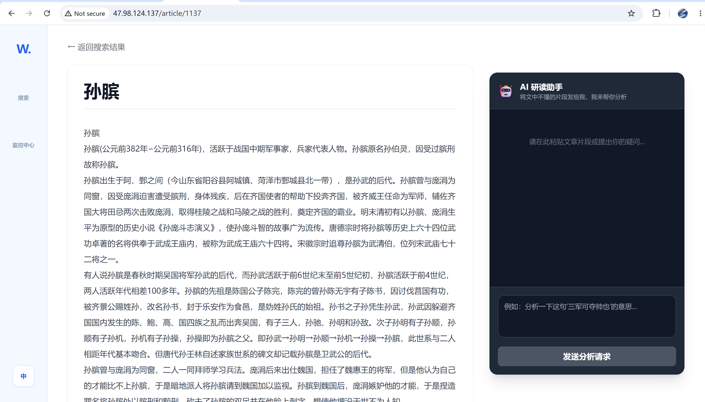
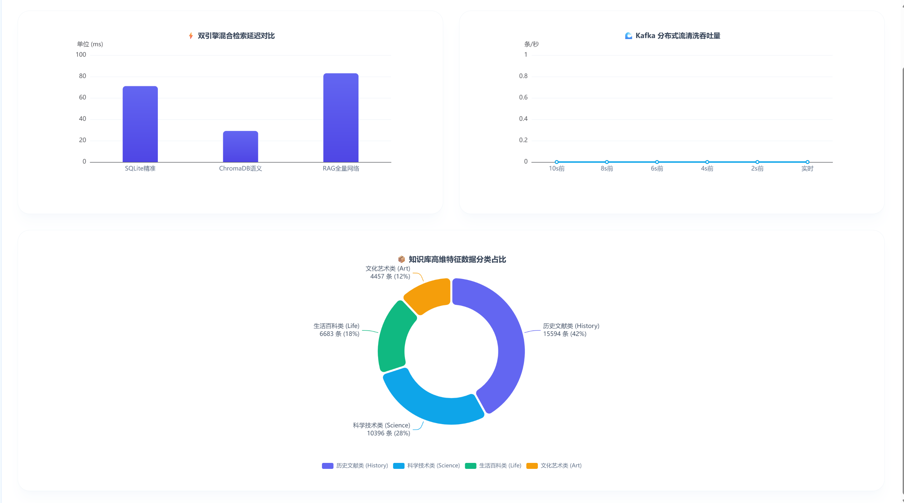

# Wiki Pro Hybrid RAG System

基于 FastAPI + ChromaDB + Kafka 的 Hybrid RAG 智能检索系统，支持关键词检索、向量语义检索与 AI 流式问答。

项目主要用于实践 RAG（检索增强生成）、异步消息队列、向量数据库、大模型 API 集成与前后端分离开发等工程能力。

---

# Features

- Hybrid RAG 混合检索
  - SQLite 关键词检索
  - ChromaDB 向量语义检索

- AI 智能问答
  - 支持 SSE 流式响应
  - 支持文章总结与上下文问答

- Kafka 异步数据处理
  - 数据清洗
  - 文本向量化
  - 向量入库流程

- 前后端分离架构
  - Vue3 + FastAPI
  - RESTful API

- 系统监控页面
  - 检索耗时统计
  - 吞吐量监控
  - 请求状态监控

- Docker 容器化部署
- Linux 云服务器部署

---

# Tech Stack

## Backend

- FastAPI
- Python
- SQLite
- Kafka
- ChromaDB
- Uvicorn

## Frontend

- Vue3
- Vite
- TailwindCSS
- Vue Router
- ECharts

## AI

- BAAI/bge-small-zh-v1.5
- DashScope Qwen API
- SSE Streaming

## Deployment

- Docker Compose
- Linux Server

---

# Architecture

```text
User Query
   │
   ▼
Hybrid Retrieval
 ├── SQLite Keyword Search
 └── ChromaDB Semantic Search
   │
   ▼
Context Merge
   │
   ▼
Qwen LLM API
   │
   ▼
SSE Streaming Response
```

---

# Project Structure

```text
wiki-rag-project/
│
├── wiki-backend/
│   ├── main.py
│   ├── ingest_v2.py
│   ├── core/
│   ├── database/
│   └── routers/
│       ├── search.py
│       ├── ai_agent.py
│       └── monitor.py
│
└── wiki-rag-web/
    ├── src/
    │   ├── views/
    │   ├── router/
    │   ├── components/
    │   └── utils/
    │
    ├── package.json
    └── vite.config.js
```

---

# Quick Start

## Backend

进入后端目录：

```bash
cd wiki-backend
```

安装依赖：

```bash
pip install -r requirements.txt
```

启动服务：

```bash
python main.py
```

---

## Frontend

进入前端目录：

```bash
cd wiki-rag-web
```

安装依赖：

```bash
npm install
```

启动开发服务器：

```bash
npm run dev
```

---

# Database

项目采用 Hybrid RAG 双检索结构：

- SQLite
  - 用于关键词精确检索
  - 存储结构化文本数据

- ChromaDB
  - 用于向量语义检索
  - 存储文本 Embedding

Kafka 用于异步数据处理与向量化流程解耦。

---

# AI Workflow

```text
Wikipedia Data
      │
      ▼
Kafka Queue
      │
      ▼
Text Cleaning
      │
      ▼
Embedding Generation
      │
      ▼
ChromaDB Storage
      │
      ▼
Hybrid Retrieval
      │
      ▼
Qwen API Response
```

---

# Screenshots

## Home Page


---

## AI Chat



---

## Monitor Dashboard



---

# Future Plans

- 多轮上下文记忆
- 搜索结果排序优化
- 模型切换支持
- 移动端适配
- 用户系统

---

# Author

Fan Fengdian

GitHub:
https://github.com/fan70dev-bit